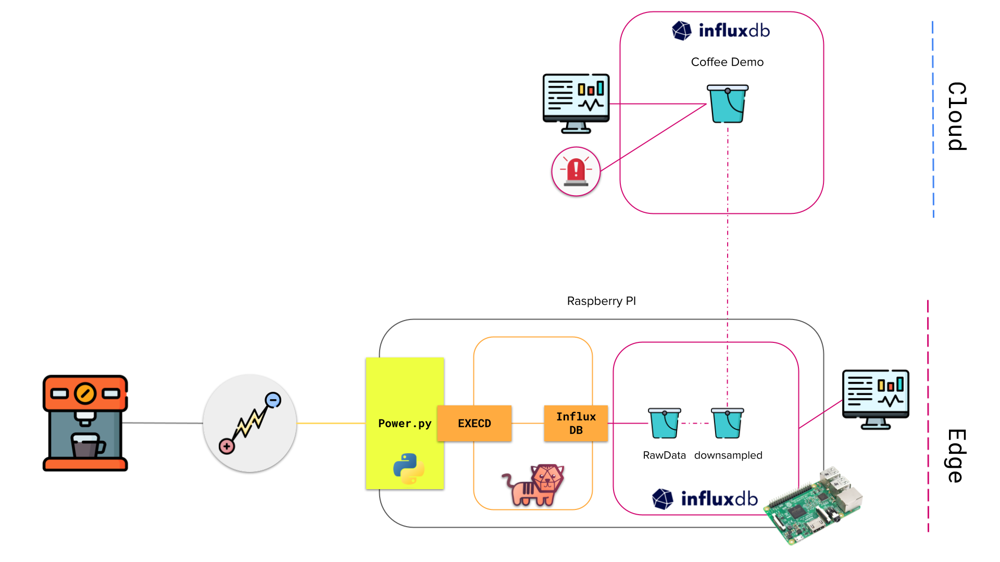
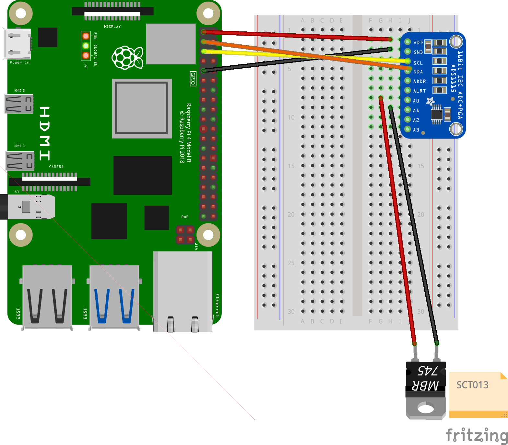
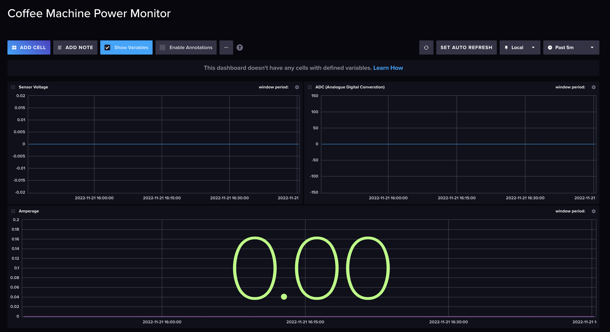
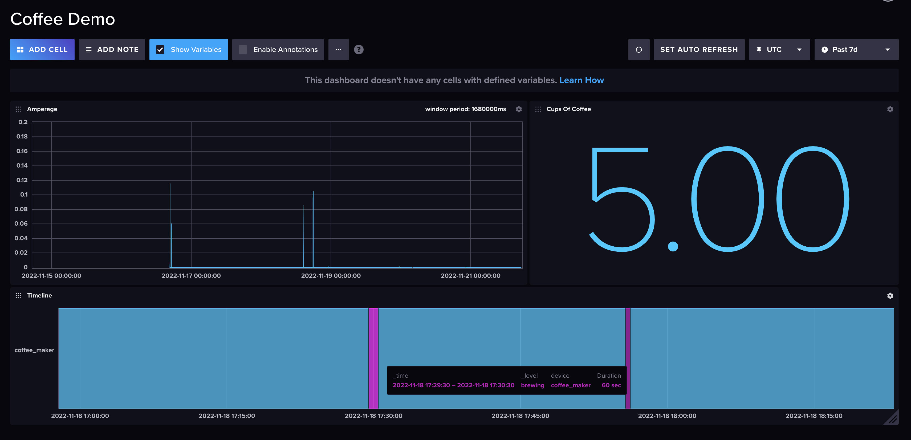

# Coffee Machine Monitor
This demonstration uses a non-invasive current sensor, Telegraf, InfluxDB OSS, and a Raspberry Pi to collect data from a coffee machine and analyze that data in several different ways in real time. We visualize data, like voltage and amperage, in a dashboard at the edge. Some data aggregations are useful for predicting supply levels, like when our demo will run out of cups. The instance of InfluxDB OSS takes the relevant data aggregations and uses the Edge Data Replication feature to automatically replicate them to an instance of InfluxDB Cloud. The Cloud dashboard triggers Twilio to send alerts to the right team members to bring more supplies when we only have 10 cups remaining. This approach provides two different user groups with two different analyses from the same set of raw data.



## Hardware
Here is a list of hardware required for creating this project:
 1. Non-invasive AC Current Sensor
 2. I2C IIC Analog-to-Digital ADC PGA Converter
 3. Raspberry PI 4+ (4GB Recommend).
 4. Breadboard and Jumper Wires Kit . 
 5. (USA ONLY) Klein Tools 69409 Line Splitter

You can find an amazon.com BOM [here](https://www.amazon.com/hz/wishlist/ls/2SC9O26SMUCP?ref_=wl_share). (USA)
You can find an amazon.co.uk BOM [here](https://www.amazon.co.uk/hz/wishlist/ls/3OZT4RSQ6T119?ref_=wl_share). (UK)
**Note you cannot purchase a Klein Tool Line Splitter in the UK. You will need to modify to an extention leed to seperate the Hot, Nutrual and Ground wire. ONLY DO THIS IF YOU ARE CONFIDENT WORKING WITH ELECTONICS**

### Wiring Diagram


## Software Setup
This section will take you through the project installation and configuration. Please make sure to have completed your hardware setup beforehand.

### Prerequisites
Before continuing with the installation process make sure you have carried out the following steps:

 1. Create an InfluxDB Cloud Account (Optional)
 2. Install the Coffee Monitor InfluxDB Cloud Template (Optional)
 3. Install the 64bit ARM OS onto your Raspberry PI
 4. Enable the I2C on your Raspberry PI. (How to [here](https://www.raspberrypi-spy.co.uk/2014/11/enabling-the-i2c-interface-on-the-raspberry-pi/))

### Installation
These next steps will be carried out via a terminal on your Raspberry PI. This can be carried our directly or via SSH:

1. Clone the repository:
```bash
git clone https://github.com/InfluxCommunity/Coffee-Machine-Monitor
```
2. Run the installation script. Root privilege is required for installing docker.
```bash
chmod +x ./Coffee-Machine-Monitor/install-script.sh
./Coffee-Machine-Monitor/install-script.sh
```
3. Create a secrets file within  ``Coffee-Machine-Monitor``.
```bash
touch ./Coffee-Machine-Monitor/.secrets
```
4. Open the secrets file and add the following details:
```
export INFLUXDB_CLOUD_TOKEN=
export INFLUXDB_CLOUD_ORG_ID=
export INFLUXDB_CLOUD_HOST=
export INFLUXDB_CLOUD_BUCKET_ID=
```
5. (Optional) Run the following configuration script to setup dashboards, tasks and Edge Data Replication. **This step is recommended unless you plan to create your own dashboards and tasks.**
```bash
sudo chmod +x ./Coffee-Machine-Monitor/setup-script.sh
./Coffee-Machine-Monitor/setup-script.sh
```

## Accessing the Demo
After setup you will be able to access the InfluxDB dashboard with the following URL: ``http://<IP-OF_PI>:8086``

Login credentials: ``influxdb:influxdb``

If you ran the setup-script you will find a prebuilt dashboard called ``Coffee Machine Power Monitor``



Turn on you coffee machine, brew a coffee and observe the amperage reading. If you installed the cloud template you will also be able to view an estimate on the number of cups of coffee brewed.



# Contributing

Pull requests are welcome. For major changes, please open an issue first to discuss what you would like to change.

Please make sure to update tests as appropriate.


 
